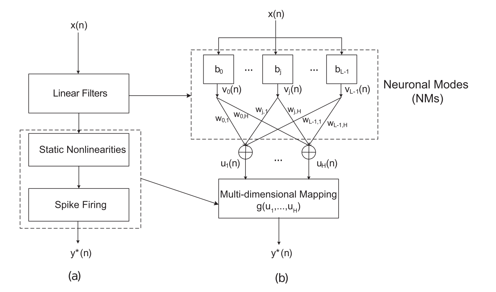

# Neuronal Mode Network (NMN)
The Neuronal Mode Network (NMN) is an advanced method to analyze the time seires binary spike train data. NMN has shown to be able to solve the "imbalanced class problem" because the number of zeros significantly out-numbers the spikes in the output data. Therefore the performance of NMN is superiror than traditional generalized linear modeling (GLM), linear-nonlinear cascade (LNC) and principal dynamic modes (PDM) models.

The architecture of NMN is shown below:

NMN is composed of two modules: (1) neuronal modes (NMs), which
are weighted combinations of Laguerre basis functions and act as a linear
filter bank, and (2) multidimensional mapping (MDM), which nonlinearly
transforms the NM outputs into spiking probabilities. The NMs represent the dynamics of the neural transformation while the MDM represents the static nonliearities in the system.

The goal of optimizing the NMN is to find a set of optimal NMs that
would separate the spiking from the non-spiking events in the MDM.

You can get more detialed descriptiosn from paper [[1]](https://www.researchgate.net/publication/333264707_Multi-Input_Multi-Output_Neuronal_Mode_Network_Approach_to_Modeling_the_Encoding_Dynamics_and_Functional_Connectivity_of_Neural_Systems).

## To run this program:

### 1.	1. Generate Binary Spike Train Data
Run [data_gen.m](data_gen.m) to generate the training data [data.mat](data.mat).

### 2.	Train the NMN model
Run [NMN_train.m](NMN_train.m). The program will use the data from [train_data.mat](train_data.mat) and optimize the parameters in NMN using simulated annealing algorithm.  The training results are summarized in [training_results.mat](training_results.mat).

### 3.Evaluate the NMN using test data
Run [NMN_test.m](NMN_test.m).  The program will load the test data from [test_data.mat](test_data.mat) and load the NMN model from [training_results.mat](training_results.mat). Then it will evaluate the model performance by ROC plots using different resolution of MDMs.

## Some additional code repos you might find useful:

Laguerre-Volterra-Network (LVN) [https://github.com/gengkunling/Laguerre-Volterra-Network](https://github.com/gengkunling/Laguerre-Volterra-Network)

Autoregressive-LVN to train Hodgkin-Huxley Equations [https://github.com/gengkunling/ASLVN](https://github.com/gengkunling/ASLVN)

Generalized Linear Model (GLM) for Modeling Neural Spike Train Data: [https://github.com/gengkunling/Generalized-Linear-Model-Neural-Spike-Train-Data](https://github.com/gengkunling/Generalized-Linear-Model-Neural-Spike-Train-Data)

## If you find this code useful, please cite:

[1] [Geng, K., Shin, D. C., Song, D., Hampson, R. E., Deadwyler, S. A., Berger, T. W., & Marmarelis, V. Z. (2019). Multi-input, multi-output neuronal mode network approach to modeling the encoding dynamics and functional connectivity of neural systems. Neural computation, 31(7), 1327-1355.](https://www.researchgate.net/publication/333264707_Multi-Input_Multi-Output_Neuronal_Mode_Network_Approach_to_Modeling_the_Encoding_Dynamics_and_Functional_Connectivity_of_Neural_Systems)

[2] [Geng, K., Shin, D. C., Song, D., Hampson, R. E., Deadwyler, S. A., Berger, T. W., & Marmarelis, V. Z. (2018). Mechanism-based and input-output modeling of the key neuronal connections and signal transformations in the CA3-CA1 regions of the hippocampus. Neural computation, 30(1), 149-183.](https://www.researchgate.net/publication/320603500_Mechanism-Based_and_Input-Output_Modeling_of_the_Key_Neuronal_Connections_and_Signal_Transformations_in_the_CA3-CA1_Regions_of_the_Hippocampus)
